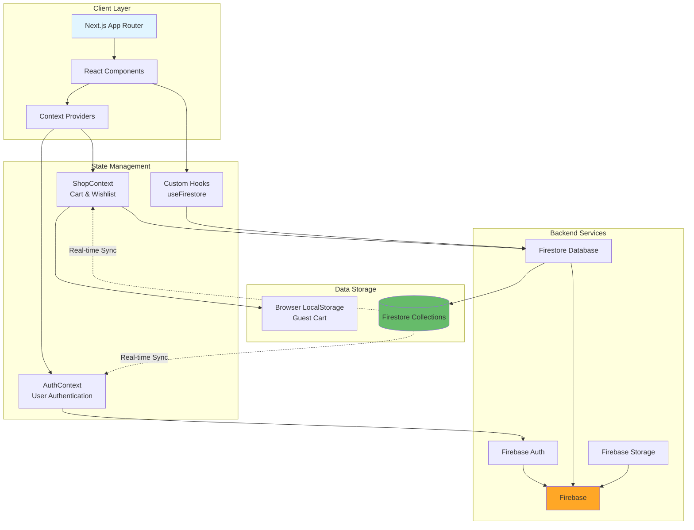
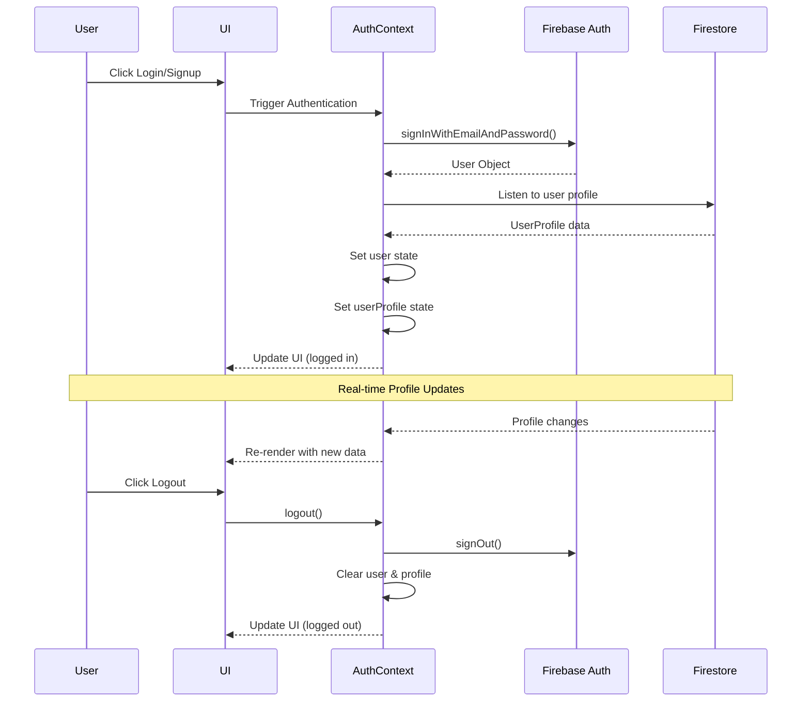
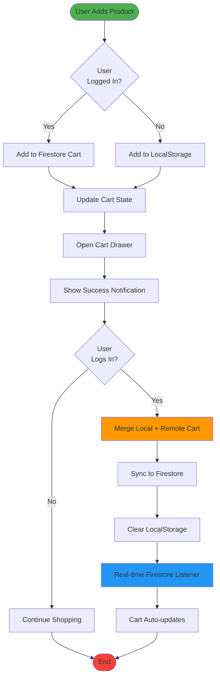
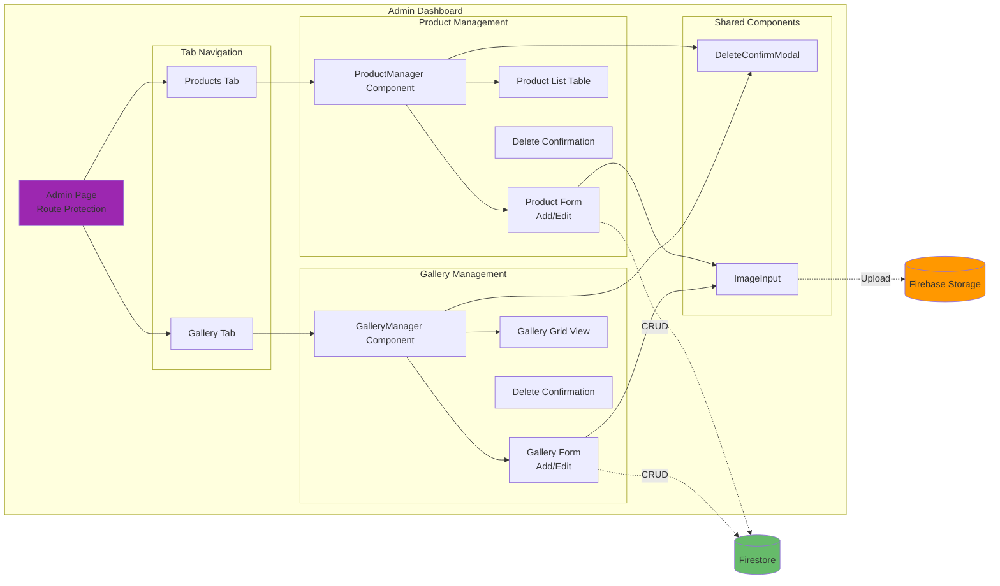
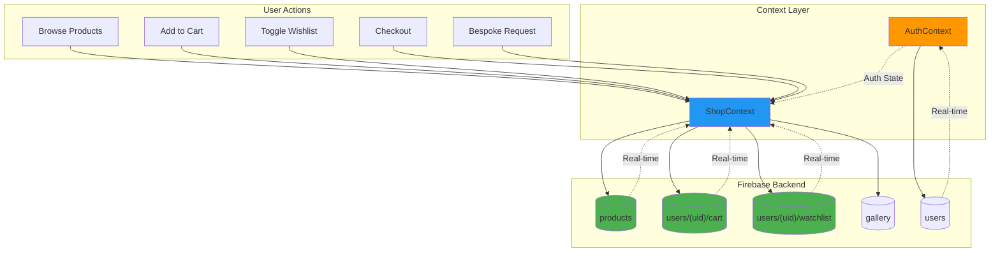
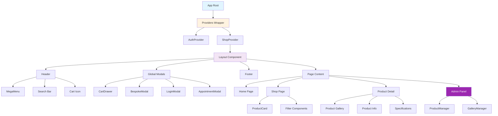
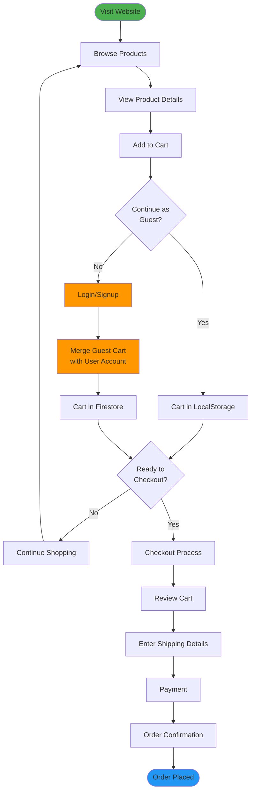

# Vinayka Rugs - Hand-Knotted Heritage

Welcome to the official repository for the **Vinayka Rugs** e-commerce platform. This application is a modern, high-performance web experience designed to showcase and sell exquisite, hand-knotted rugs from Varanasi to the world. It merges the timeless art of rug making with a premium digital user experience.

## 🌟 Overview

Vinayka Rugs is built to tell the story of craftsmanship while providing a seamless shopping experience. The platform features a rich UI with smooth animations, bespoke service requests, and a robust admin dashboard for managing inventory and showcases.

## 🚀 Features

### For Customers

- **Immersive Home Experience**: Dynamic hero sections and curated collections with high-quality imagery.
- **Shop & Discovery**: Advanced filtering and browsing for rugs by category, size, and style.
- **Product Details**: In-depth product views with zoom capabilities and detailed specifications.
- **Bespoke Services**: Dedicated forms for customers to commission custom rug designs.
- **User Accounts**: Secure login/signup via Firebase to manage profiles.
- **Cart & Checkout**: Seamless shopping cart functionality.
- **Store Locator**: Interactive feature to find physical retail locations.
- **Responsive Design**: Fully optimized for mobile, tablet, and desktop devices.
- **Interactive UI**: Powered by Framer Motion for elegant transitions and micro-interactions.

### For Administrators

- **Admin Dashboard**: Comprehensive control over the platform's content.
- **Product Management**: Add, edit, and delete rug products with image uploads.
- **Gallery Showcase**: Manage the "Curated Collections" and gallery images dynamically.
- **Secure Access**: Protected routes ensuring only authorized personnel can access admin features.

## 🛠️ Tech Stack

This project is built using a modern frontend stack ensuring performance, type safety, and scalability.

- **Framework**: [Next.js 14](https://nextjs.org/) (App Router)
- **Language**: [TypeScript](https://www.typescriptlang.org/)
- **Styling**: [Tailwind CSS](https://tailwindcss.com/)
- **Animations**: [Framer Motion](https://www.framer.com/motion/)
- **Backend / DB**: [Firebase](https://firebase.google.com/) (Authentication & Firestore)
- **Icons**: [Lucide React](https://lucide.dev/)
- **Form Validation**: [Zod](https://zod.dev/)
- **Linting & Formatting**: ESLint, Prettier

## 🏃‍♂️ Getting Started

Follow these steps to set up the project locally.

### Prerequisites

- Node.js (v18 or higher recommended)
- npm or yarn

### Installation

1.  **Clone the repository:**

    ```bash
    git clone https://github.com/your-username/vinayka_rugs.git
    cd vinayka_rugs
    ```

2.  **Install dependencies:**

    ```bash
    npm install
    # or
    yarn install
    ```

3.  **Environment Setup:**
    Create a `.env.local` file in the root directory and add your Firebase configuration keys:

    ```env
    NEXT_PUBLIC_FIREBASE_API_KEY=your_api_key
    NEXT_PUBLIC_FIREBASE_AUTH_DOMAIN=your_auth_domain
    NEXT_PUBLIC_FIREBASE_PROJECT_ID=your_project_id
    NEXT_PUBLIC_FIREBASE_STORAGE_BUCKET=your_storage_bucket
    NEXT_PUBLIC_FIREBASE_MESSAGING_SENDER_ID=your_sender_id
    NEXT_PUBLIC_FIREBASE_APP_ID=your_app_id
    ```

4.  **Run the development server:**

    ```bash
    npm run dev
    ```

5.  **Open your browser:**
    Navigate to [http://localhost:3000](http://localhost:3000) to see the application running.

## 📂 Project Structure

```text
vinayka_rugs/
├── app/                      # Next.js App Router (Pages & Layouts)
│   ├── (pages)/
│   │   ├── about/            # About page
│   │   ├── account/          # User account management
│   │   ├── bespoke/          # Custom rug requests
│   │   ├── cart/             # Shopping cart
│   │   ├── contact/          # Contact page
│   │   ├── events/           # Events showcase
│   │   ├── login/            # Authentication
│   │   ├── product/[id]/     # Dynamic product details
│   │   ├── search/           # Search results
│   │   ├── shop/             # Product listing & filters
│   │   ├── store-locator/    # Physical store locations
│   │   ├── trade-program/    # B2B program
│   │   └── watchlist/        # User watchlist
│   ├── admin/                # Admin Dashboard
│   │   ├── login/            # Admin authentication
│   │   └── page.tsx          # Main admin panel
│   ├── layout.tsx            # Root layout
│   ├── page.tsx              # Home page
│   └── providers.tsx         # Context providers wrapper
│
├── components/               # Reusable UI Components
│   ├── admin/                # Admin-specific components
│   │   ├── DeleteConfirmModal.tsx
│   │   ├── GalleryManager.tsx
│   │   └── ProductManager.tsx
│   ├── product/              # Product display components
│   ├── Search/               # Search UI components
│   ├── AppointmentModal.tsx  # Event booking modal
│   ├── BespokeModal.tsx      # Custom request form
│   ├── Button.tsx            # Reusable button
│   ├── CartDrawer.tsx        # Shopping cart sidebar
│   ├── Footer.tsx            # Site footer
│   ├── Header.tsx            # Site header with navigation
│   ├── ImageInput.tsx        # Image upload component
│   ├── LoginModal.tsx        # Authentication modal
│   ├── MegaMenu.tsx          # Navigation mega menu
│   └── ProductCard.tsx       # Product grid item
│
├── context/                  # React Context Providers
│   ├── AuthContext.tsx       # Authentication state
│   └── ShopContext.tsx       # Shopping cart & wishlist
│
├── hooks/                    # Custom React Hooks
│   └── useFirestore.ts       # Firestore data fetching
│
├── lib/                      # Utility Libraries
│   ├── firebase.ts           # Firebase configuration
│   └── product-data.ts       # Product utilities
│
├── utils/                    # Helper Functions
│   └── mockSearch.ts         # Search utilities
│
├── public/                   # Static Assets
│   └── images/               # Image files
│
├── constants.ts              # App constants
├── types.ts                  # TypeScript type definitions
└── tailwind.config.cjs       # Tailwind CSS configuration
```

## 🏗️ Architecture & Flow Diagrams

### System Architecture



### Authentication Flow



### Shopping Cart Flow



### Admin Panel Structure



### Data Flow Architecture



### Component Hierarchy



### User Journey: Guest to Purchase



## 🤝 Contributing

We welcome contributions! Please follow these steps:

1.  Fork the repository.
2.  Create a new branch (`git checkout -b feature/amazing-feature`).
3.  Make your changes.
4.  Commit your changes (`git commit -m 'Add some amazing feature'`).
5.  Push to the branch (`git push origin feature/amazing-feature`).
6.  Open a Pull Request.

## 📄 License

[MIT License](LICENSE)
